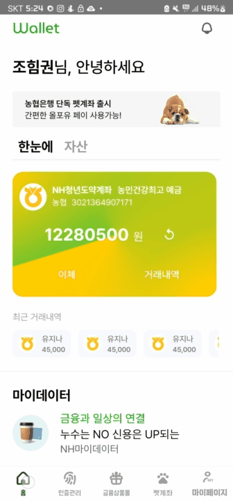
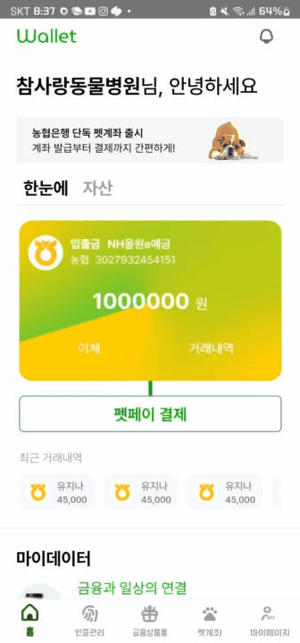
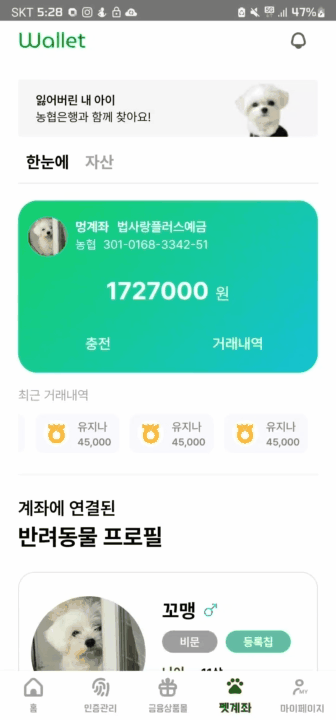
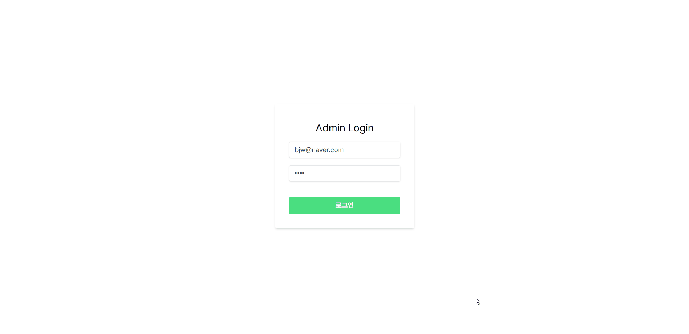
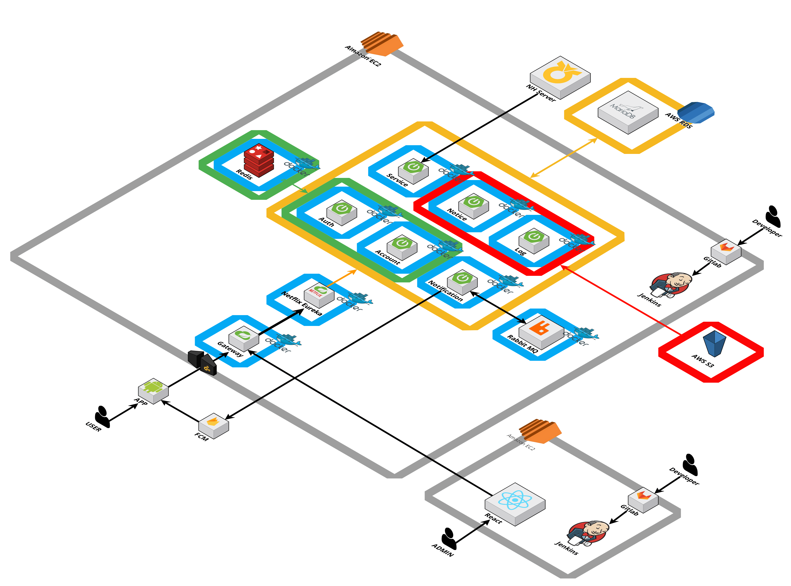

# Walet - 반려동물을 위한 pet 계좌 서비스

|  [Notion](https://ambitious-cafe-d87.notion.site/A301-14b333fbc0ba4faebe0fc6498f000959?pvs=4) |  [Figma](https://www.figma.com/file/301GJlg4OmMEoFQxXut2ZQ/SSAFY_%EA%B8%B0%EC%97%85%EC%97%B0%EA%B3%84_%EB%86%8D%ED%98%91?type=design&node-id=0-1&mode=design&t=ursBjYyjVusKYyaj-0) |

 

## 기간 & 특이사항

- 2023.10.09 ~ 2023.11.17
- 농협은행 기업 연계 프로젝트

 

## 서비스 소개

- 반려동물 전용 사용 용도 계좌를 활용한 내/외장 등록칩 기반 간편결제 서비스
- 농협의 API를 활용하여 이체 및 양도 기능 제공

## 기획 배경

- 반려 가구는 총 552만 가구로 반려동물과 함께하는 시대가 다가왔음
- 반려동물을 위한 금융 상품들의 대두 (펫 적금, 펫 보험 등)

## 프로젝트 간 기업 요구사항

### 필수 사항

- 회원 가입 및 로그인
- 계좌 등록 및 NH 오픈 플랫폼 API를 통한 핀어카운트 발급
- NH 오픈 플랫폼 API를 통한 입출금 계좌 간 이체
- 거래 기간별 거래 내역 조회 및 거래 로그 저장
- 공지사항 게시판(모달/레이어 팝업) 및 사용자별 권한 부여
- 관리자 페이지
  - 공지사항 게시판 관리
  - 앱 서비스 메인 화면에 팝업 노출할 공지사항 선택 기능
  - 고객 정보 조회 및 수정

### 추가 구현 기능

- 입출금에 대한 FCM(Firebase Cloud Messaging)으로 푸시 알림
- 관리자 페이지 내 일별 전체거래량, 전체거래금액 등 시각화(차트)
- 분리된 Web, Was 서버 구현

## 주요 기능

## Mobile

### 이체

- 상대방의 계좌번호를 입력하고 원하는 금액을 송금  

 

### 결제 요청

- 사업자가 결제금액을 입력
- 가게에 있는 블루투스 기기로 반려동물의 등록 코드를 인식
- 반려동물의 정보가 뜨고 구매자가 '확인'을 누르면 주인 휴대폰으로 결제 요청    

### 결제 승인

- 반려동물 주인이 결제 요청을 수락하면 펫 계좌에서 돈이 자동으로 사업자의 계좌로 이체   

### 펫 계좌 양도 신청

- 양도할 대상의 정보와 메시지를 입력하여 펫 계좌 양도 요청    

### 펫 계좌 양도 받기

- 양도 요청을 확인하고, 이를 수락하여 펫 계좌 양도가 완료    

### 펫 계좌 충전

- 연결돼 있는 충전 계좌로부터 펫 계좌에 필요한 금액을 충전   

## Web

### 관리자 페이지(로그인)

- 관리자 전용 로그인 (일반 사용자 로그인 불가)    

 

### 로그 시각화 및 유저 거래 정보 조회

- 로그를 시각화하여 전체 거래량, 전체 거래 금액 등 확인 가능
- 발생한 거래 내역들에 대한 로그 체크 가능
- 유저의 계좌에서 발생한 거래 로그 확인 가능
- 유저의 상태 변경 가능   

### 공지사항 관리 및 메인 공지사항 설정

- 공지사항 생성, 수정, 삭제 가능
- 모바일 화면 상단의 팝업 노출 여부 선택 가능    

## 기술 스택

<h3 align="center">Frontend</h3>

    
    
    
    
    
    
     
    
    
    
    

<h3 align="center">Backend</h3>

    
    
    
    
    
     
    
       
    
    
    
    

<h3 align="center">Mobile</h3>

    
    
    

<h3 align="center">CI/CD</h3>

    
    
 
     
    
    
    

<h3 align="center">Co-work tool</h3>

    
    
    
    
    
    

## Architecture

 

### ERD

## NH 멘토님

<table>
  <tr>
    <td align="center" width="200" height="100">
        
    </td>
    <td align="center" width="200" height="100">
        
    </td>
  </tr>
  <tr>
    <td align="center">
        <b>김현욱 멘토님</b>
    </td>
    <td align="center">
        <b>원종호 멘토님</b>
    </td>
  </tr>
  <tr>
    <td align="center">
       NH 은행 멘토
    </td>
    <td align="center">
      NH 은행 멘토
    </td>
  </tr>
</table>

## 역할분담

<table>
  <tr>
    <td align="center" width="200">
        
    </td>
     <td align="center" width="200">
        
    </td>
    <td align="center" width="200">
        
    </td>
    <td align="center" width="200">
        
    </td>
    <td align="center" width="200">
        
    </td>
    <td align="center" width="200">
        
    </td>
  </tr>
  <tr>
    <td align="center">
        <b>이승엽</b>
    </td>
    <td align="center">
        <b>금세현</b>
    </td>
    <td align="center">
        <b>김보석</b>
    </td>
    <td align="center">
        <b>송희도</b>
    </td>
    <td align="center">
        <b>신재혁</b>
    </td>
    <td align="center">
        <b>유지나</b>
    </td>
  </tr>
  <tr>
    <td align="center">
      Backend / 팀장
    </td>
    <td align="center">
      Backend
    </td>
    <td align="center">
      Frontend/IoT  Backend/Infra
    </td>
    <td align="center">
      Backend/Infra
    </td>
    <td align="center">
      Mobile
    </td>
    <td align="center">
      Mobile
    </td>
  </tr>
</table>
